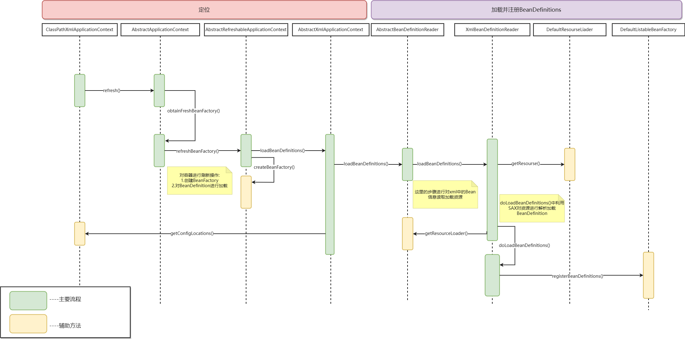
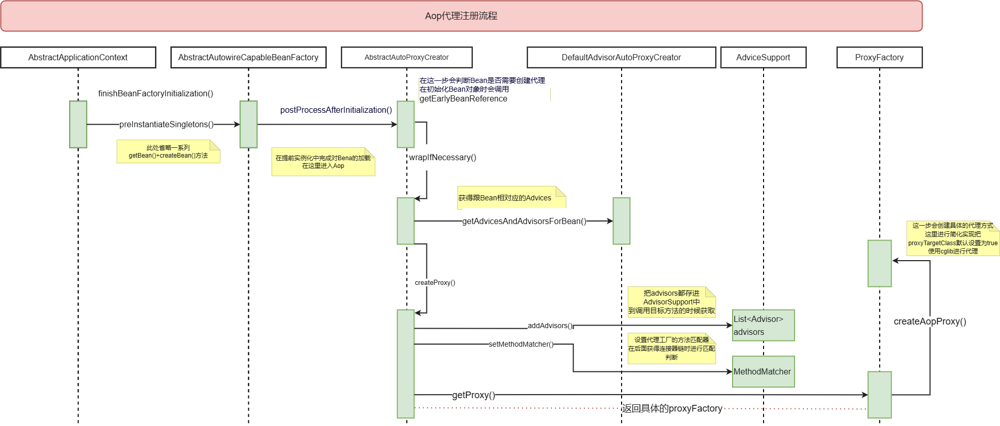
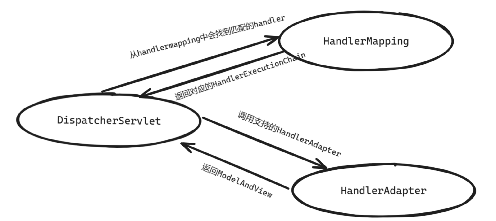
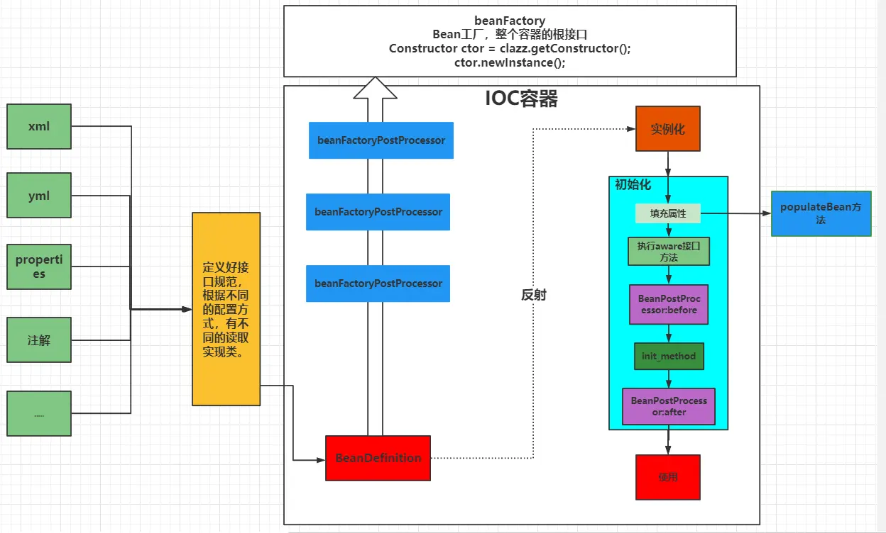
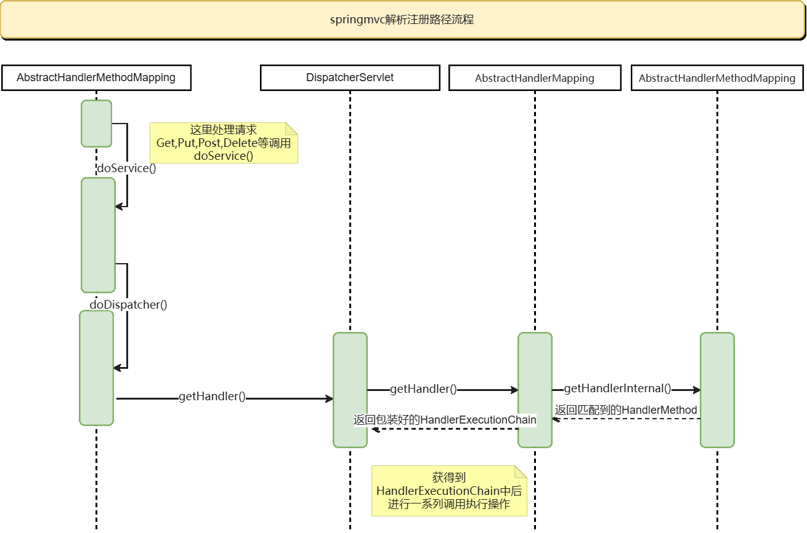

# 手写Spring源码项目介绍

该项目用于自我学习过程中的实践

[spring项目结构](spring模块/src/main/tr.txt)

- 飞书文档：https://zquk8ow8fg6.feishu.cn/wiki/ActQw0AK7iPvvvkPkhlcpCIjnRh?from=from_copylink

其中分为spring模块和springmvc模块

spring模块只实现了xml注册Bean的部分

springmvc模块依赖于org.springframework中的spring的ioc和web模块

- xml依赖于XmlBeanDefinitionReader实现注册Bean

- 注解主要依赖于ClassPathBeanDefinitionScanner实现扫描注册Bean


## Ioc模块

### 1.加载并注册BeanDefinitions



### 2.Spring中预先加载单例Bean(包括getBean())

.png)


在对Bean的属性填充populateBean()
循环依赖的解决：三级缓存
在DefaultSingletonBeanRegistry设置有三个map用于实现三级缓存，解决循环依赖问题
- singletonObjects         第一级缓存，用于保存实例化、注入、初始化完成的bean实例
- earlySingletonObjects  第二级缓存，存放原始的 bean 对象（尚未填充属性），用于解决循环依赖
- singletonFactories       第三级缓存，用于保存bean创建工厂，以便于后面扩展有机会创建代理对象。
其中第三级缓存中添加ObjectFactory对象，对象可能需要经过Aop，通过getEarlyBeanReference方法获取代理对象
如果不实现Aop功能，二级缓存是足够解决循环依赖的


## Aop模块

Aop代理注册流程



## Jdbc模块

JdbcTemplate继承了JdbcAccessor和接口JdbcOperation。

JdbcAccessor主要是对DataSource进行管理和配置。

JdbcOperation主要是通过JDBC操作数据库的基本操作方法。


## MVC模块

该模块要依赖于org.springframework中的spring的ioc和web模块



### 1.初始化父子容器

- ContextLoadListener创建了一个Spring容器作为父容器，里面主要管理Service和数据。

- DispatcherServlet创建了一个Springmvc容器，作为Spring容器的子容器，管理Controller层。

  子容器可以获取到父容器中的对象，Controller里面可以注入Service层级的对象。



  在对容器初始化中会初始化其中的Bean,其中初始化**WebMvcConfigurationSupport**时会对其中定义的**HandlerMapping**，**HandlerAdapter**等容器Bean进行初始化

  ```java
  ## com.zhang.web.config.WebMvcConfigurationSupport
  ...
  @Bean
      public HandlerMapping handlerMapping(){
          final RequestMappingHandlerMapping requestMappingHandlerMapping = new RequestMappingHandlerMapping();
          requestMappingHandlerMapping.setOrder(0);
          final InterceptorRegistry registry = new InterceptorRegistry();
          getIntercept(registry);
          // todo 通过 registry 获取 MappedInterceptor
          // 获取拦截器
          final List<MappedInterceptor> interceptors = registry.getInterceptors();
          requestMappingHandlerMapping.addHandlerInterceptors(interceptors);
          // 添加拦截器
          return requestMappingHandlerMapping;
      }
  ...
  ```


### 2.把@RequestMapping上的路径注册给程序并放入缓存中的

spring在启动的时候会初始化AbstractHandlerMethodMapping类，他实现了InitializingBean的接口

对HandlerMapping初始化结束之后调用**afterPropertiesSet**()进行对方法中的路径进行解析存储**MappingRegistry**中。


### 3.处理请求




