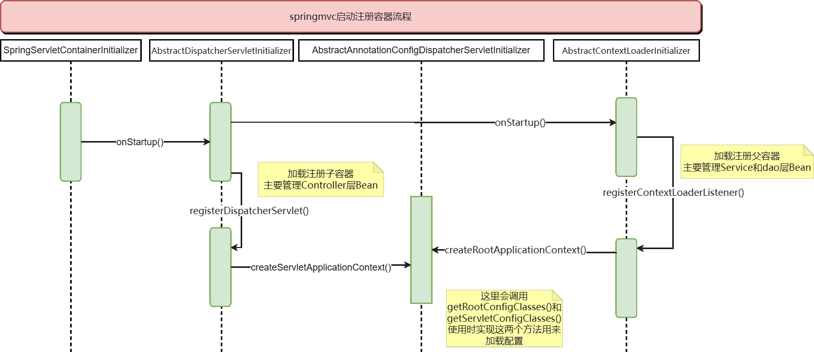

# 手写Spring源码项目介绍

该项目用于自我学习过程中的实践
[各类解释](src%2Fmain%2Fjava%2Fcom%2Fzhang%2Ftr.txt)

## Ioc模块

### 1.加载并注册BeanDefinitions


### 2.Spring中预先加载单例Bean(包括getBean())

.png)

## Aop模块

Aop代理注册流程


## Jdbc模块

JdbcTemplate继承了JdbcAccessor和接口JdbcOperation。

JdbcAccessor主要是对DataSource进行管理和配置。

JdbcOperation主要是通过JDBC操作数据库的基本操作方法。


## MVC模块

该模块要依赖于org.springframework中的spring的ioc和web模块


### 1.初始化父子容器

- ContextLoadListener创建了一个Spring容器作为父容器，里面主要管理Service和数据。

- DispatcherServlet创建了一个Springmvc容器，作为Spring容器的子容器，管理Controller层。

  子容器可以获取到父容器中的对象，Controller里面可以注入Service层级的对象。



  在对容器初始化中会初始化其中的Bean,其中初始化**WebMvcConfigurationSupport**时会对其中定义的**HandlerMapping**，**HandlerAdapter**等容器Bean进行初始化

  ```java
  ## com.zhang.web.config.WebMvcConfigurationSupport
  ...
  @Bean
      public HandlerMapping handlerMapping(){
          final RequestMappingHandlerMapping requestMappingHandlerMapping = new RequestMappingHandlerMapping();
          requestMappingHandlerMapping.setOrder(0);
          final InterceptorRegistry registry = new InterceptorRegistry();
          getIntercept(registry);
          // todo 通过 registry 获取 MappedInterceptor
          // 获取拦截器
          final List<MappedInterceptor> interceptors = registry.getInterceptors();
          requestMappingHandlerMapping.addHandlerInterceptors(interceptors);
          // 添加拦截器
          return requestMappingHandlerMapping;
      }
  ...
  ```


### 2.把@RequestMapping上的路径注册给程序并放入缓存中的

spring在启动的时候会初始化AbstractHandlerMethodMapping类，他实现了InitializingBean的接口

对HandlerMapping初始化结束之后调用**afterPropertiesSet**()进行对方法中的路径进行解析存储**MappingRegistry**中。


### 3.子容器实现初始化

### 处理请求


